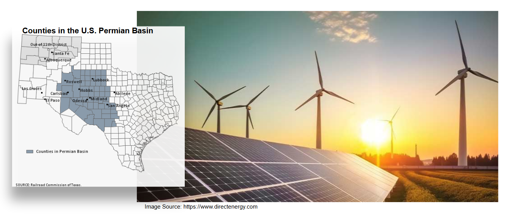

# Capstone Project for the AI ML course
## Professional Certificate in Machine Learning and Artificial Intelligence - Berkley-Hass Program

# Renewable Energy Project Opportunities in the Texas Permian Basin
## - Supervised Learning: Linear Regression Analysis Workbook
(A Capstone Project for AI ML Certificate Course (July 2025) - Muhammad Zafar

Overview 
--------
Renewable energy projects, like wind and solar, offer plenty of investment opportunities in the emerging market for net-zero carbon world. The transition to clean energy is essential to meet the Paris Climate Agreement's goal of reduced carbon emissions by 2030. Eventual goal is to get to net-zero carbon by 2050. This requires major shifts in energy use patterns from hydrocarbon-based resources (oil, natural gas, coal) to renewable energy sources, primarily land-based wind, off-shore wind and solar energy sources. There are also battery energy sources (BESS) as well as distributed wind and solar rooftop commercial and residential opportunities.

This project will explore investment opportunities for renewable energy projects in the Permian Basin area in Texas, USA.

Internet access is critical for long-term viability of deploying renewable energy projects in an area. Internet access allows the local population to learn and develop knowledge and skills for jobs in the renewable industry and also to keep updating skills as the industry develops. To attract new and younger workers to the area, good internet access is normally deemed necessary for investment in renewable energy projects. Lack of internet access can be a negative factor for investment since it impedes worker learning and development.

Data Sources
-------------
The National Renewable Energy Lab (NREL) (https://www.nrel.gov/) is one of the premiere U.S. government research labs that shares information on the use and deployment of renewable energy technologies and projects in the U.S. The NREL Permian Energy Development Lab (PEDL) published a data set for socioeconomic (including energy production) data for all the counties in the Permian Basin in Texas and New Mexico.

The dataset are organized into four categories: Socioeconomics, Health & Wellbeing, Jobs & Workforce, and Energy Infrastructure & Potential.  
Each category contains multiple data elements the details of those are provided in a separate file: [nrel_ses_permian_basin_counties_metadata.txt](data/nrel_ses_permian_basin_counties_metadata.txt)

**About Socioeconomic data for Permian Basin (U.S. Texas):**  
This dataset was compiled to support socioeconomic analyses of counties in the Permian Basin in Texas and New Mexico for the Permian Energy Development Lab (PEDL). The metrics in the dataset are organized into four categories: Socioeconomics, Health & Wellbeing, Jobs & Workforce, and Energy Infrastructure & Potential. The metrics originated from previously published datasets, including SLOPE, LEAD, Rural Atlas, EJScreen, and Census data.
USE: this dataset can be used to understand the socio-economic status of the people in the Permian basin and their use of technology and related tools.

**Reference:**  
Socioeconomic Data for the Permian Basin | NREL Data Catalog  
Ross, Liz. 2024. "Socioeconomic Data for the Permian Basin." NREL Data Catalog. Golden, CO: National Renewable Energy Laboratory. Last updated: January 16, 2025. Available at https://www.nrel.gov.

Federal Reserve Bank of Dallas. Permian Basin Energy Resources Background. Available at https://www.dallasfed.org/research/energy11/permian.
 

Methodology
------------
1) Use **Exploratory Data Analysis** to determine which counties offer best opportunities to invest in renewable energy projects and type of project

2) Build correlation matrix and pair-plots to understand relationships between input variables

3) **Supervised learning methods:** \
    a) Using linear regression to build a model that can explain what factors determine internet access in a county in the Permian basin 
    
       Dependent variable: NoInternet_PctTractsOver75thPctile
       Independent variables: socio-economic variables in the dataset  (selected columns)
   

    b) Use Ridge regression and model pipeline method to improve model accuracy from step 3. Draw out MSE vs 1/alpha curves for training and development MSEs to find the optimum model parameters without over-fitting. 
    
    c) Use Lasso regression to select significant features (columns) in the dataset.

    d) Use Ridge regression with selected columns identified by Lasso.
    
    e) Compare results for all models
 
Note: For linear regression analysis we use the entire dataset for the U.S. Permian Basin (Texas and New Mexico counties) to understand the relationship of NoInternet_PctTractsOver75thPctile to the socio-eceonomic factors in the region.  
 

