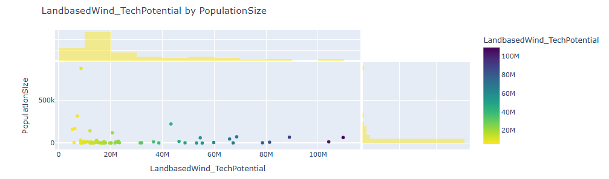

## Professional Certificate in Machine Learning and Artificial Intelligence - Berkley-Hass Program
### Capstone Project Report
(Final Capstone Project for AI & ML Certificate Course from UC Berkely, CA (July 2025)  
**Author: Muhammad Zafar**
Contact: www.linkedin.com/in/muhammad-usman-zafar-36b9199

### Report Title: Renewable Energy Project Opportunities in the Texas Permian Basin

Overview 
--------
Renewable energy projects, like wind and solar, offer plenty of investment opportunities in the emerging market for net-zero carbon world. The transition to clean energy is essential to meet the Paris Climate Agreement's goal of reduced carbon emissions by 2030. Eventual goal is to get to net-zero carbon by 2050. This requires major shifts in energy use patterns from hydrocarbon-based resources (oil, natural gas, coal) to renewable energy sources, primarily land-based wind, off-shore wind and solar energy sources. There are also battery energy sources (BESS) as well as distributed wind and solar rooftop commercial and residential opportunities.

**This project will explore investment opportunities for renewable energy projects in the Permian Basin area in Texas, USA.**

**Internet access** is critical for long-term viability of deploying renewable energy projects in an area. Internet access allows the local population to learn and develop knowledge and skills for jobs in the renewable industry and also to keep updating skills as the industry develops. To attract new and younger workers to the area, good internet access is normally deemed necessary for investment in renewable energy projects. Lack of internet access can be a negative factor for investment since it impedes worker learning and development.

Research Question (Primary)
---------------------------
#### Which counties in the Permian Basin in the state of Texas are best suited for investment in renewable energy projects and why? What type of projects are suitable to develop in those areas? 

Secondary Question:
-------------------
#### Using the socio-economic data of the Permian Basin identify top factors that contribute to the lack of internet access for workers in a given county. How may this impact the decision to invest in a renewable energy project in that county?
 

Data Sources
-------------
The National Renewable Energy Lab (NREL) (https://www.nrel.gov/) is one of the premiere U.S. government research labs that shares information on the use and deployment of renewable energy technologies and projects in the U.S. The NREL Permian Energy Development Lab (PEDL) published a data set for socioeconomic (including energy production) data for all the counties in the Permian Basin in Texas and New Mexico.

The dataset are organized into four categories: Socioeconomics, Health & Wellbeing, Jobs & Workforce, and Energy Infrastructure & Potential.  
Each category contains multiple data elements the details of those are provided in a separate file: [nrel_ses_permian_basin_counties_metadata.txt](data/nrel_ses_permian_basin_counties_metadata.txt)

**About Socioeconomic data for Permian Basin (U.S. Texas):**  
This dataset was compiled to support socioeconomic analyses of counties in the Permian Basin in Texas and New Mexico for the Permian Energy Development Lab (PEDL). The metrics in the dataset are organized into four categories: Socioeconomics, Health & Wellbeing, Jobs & Workforce, and Energy Infrastructure & Potential. The metrics originated from previously published datasets, including SLOPE, LEAD, Rural Atlas, EJScreen, and Census data.
USE: this dataset can be used to understand the socio-economic status of the people in the Permian basin and their use of technology and related tools.

**References:**  
Socioeconomic Data for the Permian Basin | NREL Data Catalog  
Ross, Liz. 2024. "Socioeconomic Data for the Permian Basin." NREL Data Catalog. Golden, CO: National Renewable Energy Laboratory. Last updated: January 16, 2025. Available at https://www.nrel.gov.

Federal Reserve Bank of Dallas. Permian Basin Energy Resources Background. Available at https://www.dallasfed.org/research/energy11/permian.
 

Methodology
------------
1) Use **Exploratory Data Analysis** to determine which counties offer best opportunities to invest in renewable energy projects and type of project

2) Build **Correlation Matrix and Pair-Plots** to understand relationships between input variables

3) **Supervised learning methods:** \
    a) Using linear regression to build a model that can explain what factors determine internet access in a county in the Permian basin 
    
       `Dependent variable: NoInternet_PctTractsOver75thPctile`
       `Independent variables: socio-economic variables in the dataset  (selected columns)`

    b) Use Ridge regression and model pipeline method to improve model accuracy from step 3. Draw out MSE vs 1/alpha curves for training and development MSEs to find the optimum model parameters without over-fitting. 
    
    c) Use Lasso regression to select significant features (columns) in the dataset.

    d) Use Ridge regression with selected columns identified by Lasso.
    
    e) Compare results for all models
 
 

Exploratory Data Analysis
-------------------------
What did your research find?

TODO
-- add EDA summary
-- add Internet presence summary
-- further details & Charts in the Presentation

The U.S. Permian Basin is an area of land that spreads across the Western Texas and Eastern New Mexico states. The area comprises of 66 counties out of which 60 are in the state of Texas and 6 in New Mexico. First we explore the characteristics of the counties that comprise the U.S. Permian Basin.  
Chart below shows county population size by counties. Largest county is El Paso with 867.9K.  

  
Chart below shows population size by counties for top-10 counties by size.

Other Socio-economic characteristics are shown in the charts below --
- Population is relatively young (under 18) in many counties
- Median household income ranges between 40K to about 70K for most of the counties, with some exceptions on low and high end.
- Unemployment rate average is around 5% which highlights economic opportunities for the people in the region.

  

SVI_OverallRanking - Composite Social Vulnerability Index (SVI) score ranks communities based on four vulnerability themes - socioeconomic, housing, minority status, transportation. Low scores (0.0) indicate low Vulnerability and high scores (1.0) indicate high Vulnerability.  
- In more than half counties the SVI Overall ranking is > 0.6 indiccating moderate to high vulnerability. 
- In many counties more than 15 percent of the workers are employed in the natural resources construction and maintenance sector. This sector is related to developing energy infrastrcuture projects in the region.   

  
Table and chart below shows technical potential of rewnewable energy projects in the Permian Basin overall.  
- UtlityPV has the highest total technical potential of over 14000 MW
- Followed by LandbasedWind with total potential of 1800 MW
- Next is distributed wind (342 MW) and CommercialPV (11.6 MW). 
- Clearly the top two areas to invest with the highest potential is UtilityPV and LandbasedWind technologies.

ADD TEXT HERE

Understanding what factors determine Internet Access for a county
-----------------------------------------------------------------
Using Supervised learning methods we analyzed what factors (characteristics) determine internet access in a county.

       `Dependent variable: NoInternet_PctTractsOver75thPctile`
       `Independent variables: socio-economic variables in the dataset  (selected columns)`
	   
**Correlation Analysis & PairPlots Across all factors**

**Linear Regresion Models (selected columns)**

These columns were selected based on the correlation analysis across all columns that had a higher positive or negative correlation with the NoInternet_PctTractsOver75thPctile column.

select_cols = ['PopulationSize', 'PopulationChangeRate_2010_2020', 'PopulationChangeRate_2020_2021', 'GDP_2021_thousands', 'DAC_StatusYES_PctTracts', \
    'SVI_OverallRanking', 'SVI_Socioeconomic', 'SVI_HouseholdCharacteristics', 'SVI_MinorityStatus', 'PctAge65andOlder', 'PctUnderAge18', 'PctHispanic', 'MedianHHInc', \
    'PovertyRate', 'UnemploymentRate']

y = data_clean[['NoInternet_PctTractsOver75thPctile']]
X = data_clean[select_cols]
X_train, X_test, y_train, y_test = train_test_split(X, y, test_size=0.3, random_state=randval)

['PopulationSize',
 'PopulationChangeRate_2010_2020',
 'PopulationChangeRate_2020_2021',
 'GDP_2021_thousands',
 'DAC_StatusYES_PctTracts',
 'SVI_OverallRanking',
 'SVI_Socioeconomic',
 'SVI_HouseholdCharacteristics',
 'SVI_MinorityStatus',
 'PctAge65andOlder',
 'PctUnderAge18',
 'PctHispanic',
 'MedianHHInc',
 'PovertyRate',
 'UnemploymentRate']
 
large_col_set = \
['PopulationSize',
 'PopulationChangeRate_2010_2020',
 'PopulationChangeRate_2020_2021',
 'GDP_2021_thousands',
 'DAC_StatusYES_PctTracts',
 'SVI_OverallRanking',
 'SVI_Socioeconomic',
 'SVI_HouseholdCharacteristics',
 'SVI_MinorityStatus',
 'PctAge65andOlder',
 'PctUnderAge18',
 'PctHispanic',
 'MedianHHInc',
 'PovertyRate',
 'UnemploymentRate',
 'NoInternet_PctTractsOver75thPctile',
 'ElectricalPowerTransmissionLine_km',
 'ElectricalPowerTransmissionLine_miles',
 'CrudeOilPipeline_km',
 'CrudeOilPipeline_miles',
 'PetroleumPipeline_km',
 'PetroleumPipeline_miles',
 'NaturalGasPipeline_km',
 'NaturalGasPipeline_miles',
 'CO2Pipelines_km',
 'CO2Pipelines_miles',
 'UtilityPV_TechPotential',
 'ResidentialPV_TechPotential',
 'CommercialPV_TechPotential',
 'LandbasedWind_TechPotential',
 'DistributedWind_TechPotential',
 'GeothermalHeatPump_EconPotential']
 
Models Built:
Linear Regression
Scaled Ridge Regression
- Add MSE Chart
- feature and coeff
Lasso Scaled Regression model
- feature and coeff
- MSE Chart
Lasso #2: larger col. set
- feature and coeff
- MSE Chart

**Model results summary table**

	
ADD TEXT HERE

**Best Model features - Scaled Ridge Regression (with alpha =10.0)**  
array([[-7.96303713, -4.70005285, -5.95631507, -3.21940584, -1.75589309,
         1.9177168 ,  2.33335125,  2.83934251,  2.16379391,  2.92041422,
         2.445844  ,  3.52093759,  4.45729818,  4.44419837,  6.65594881]])
Features(['MedianHHInc', 'PopulationChangeRate_2010_2020', 'SVI_Socioeconomic',
       'ElectricalPowerTransmissionLine_km',
       'GeothermalHeatPump_EconPotential', 'PetroleumPipeline_km',
       'SVI_HouseholdCharacteristics', 'PovertyRate', 'NaturalGasPipeline_km',
       'UnemploymentRate', 'PctHispanic', 'CrudeOilPipeline_km',
       'SVI_MinorityStatus', 'PctAge65andOlder', 'DAC_StatusYES_PctTracts'])

	  

Recommendations
---------------
What suggestions do you have for next steps?

TODO
-- Target these counties

-- Target these types of projects

-- Further work:
Perform financial cost/benefit & ROI analysis and choose projects with highest ROIs over a 10-year or more horizon.

Project Outline
---------------
- [Exploratory Data Analysis Notebook - ses_data_permian_counties_EDA_analysis.ipynb](https://github.com/muhammad-zafar1/aiml_cert_capstone/blob/main/ses_data_permian_counties_EDA_analysis.ipynb)
- [Supervised Learning - Regression Notebook - ses_data_permian_counties_regression.ipynb](https://github.com/muhammad-zafar1/aiml_cert_capstone/blob/main/ses_data_permian_counties_regression.ipynb)

#### Contact and Further Information:
Content in this repository is the property of the author. Please do NOT duplicate without getting prior authorization from the author.  
Contact: www.linkedin.com/in/muhammad-usman-zafar-36b9199

#### END OF REPORT ####

